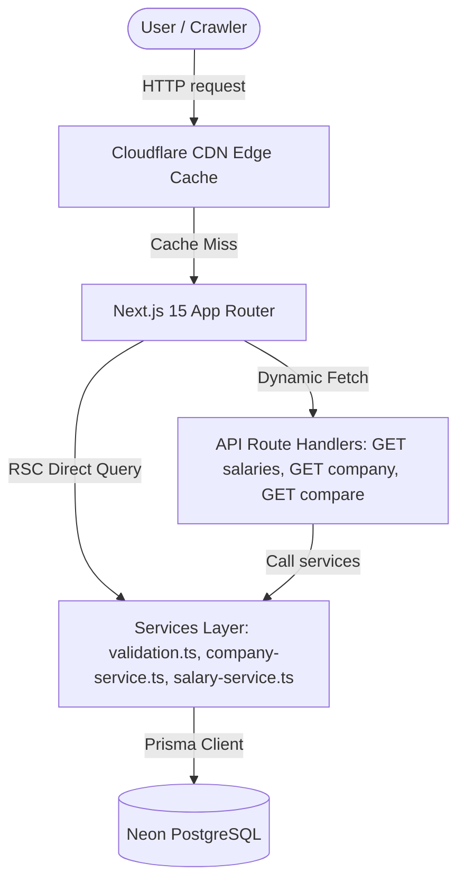
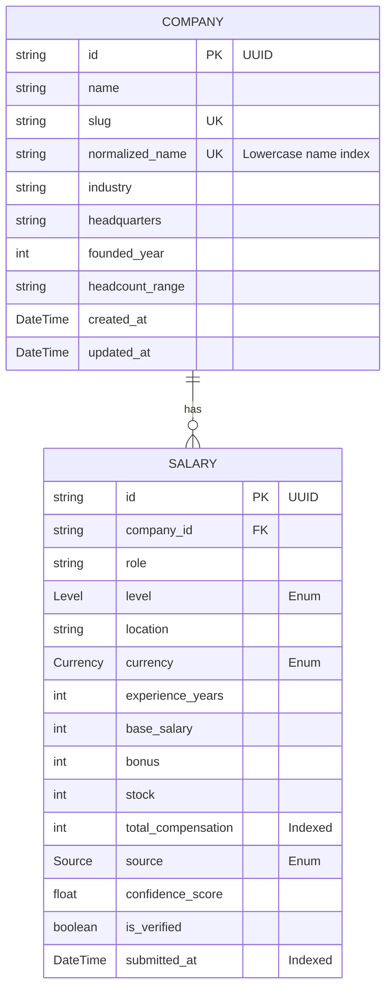

# 🚀 TalentDash — Compensation & Career Intelligence Platform

TalentDash is a high-performance, data-first compensation intelligence platform built to serve structured, comparable, and decision-ready career metrics at internet scale. Unlike traditional job boards or company review hubs, TalentDash is designed with a static-first, zero-infrastructure-cost architecture optimized for search engine crawl efficiency (SEO) and global content caching.

---

## 📖 Overview

In modern recruiting, compensation data is noisy and unstructured. TalentDash bridges this gap by enforcing standard data normalization rules at ingestion boundaries to map various job levels, locations, currencies, and roles into clean, structured indices. The core business engine relies on high traffic driven by search engines (SEO) to prebuilt landing pages, which serve career intelligence at global edges (via Cloudflare Pages/CDN) with minimal database server costs.

---

## 🌟 Features

* **Salary Intelligence Feed (`/salaries`)**: Responsive, paginated compensation table displaying salary packages (base salary, performance bonus, stock options, and total compensation) formatted using the Indian Numbering System (Lakh/Crore) and local USD structures.
* **Filter Bar & Parameters Synced Navigation**: Instant search filtering by company name, role selection, level multi-select options, location, and currency toggle. URL states sync parameters for shareable links.
* **Company Profiles (`/companies/[slug]`)**: Dynamic static pages (SSG/ISR) computing true statistical medians, compensation ranges, total contributions, and stacked Level Distribution visual bars.
* **Side-by-Side Comparison Tool (`/compare`)**: side-by-side comparison selector calculating difference deltas for every financial compensation element with green/red differential formatting and "Higher TC" winner badges.
* **Verification & Duplicate Protection**: Anti-spam mechanisms that reject similar submissions (within 10% bounds) from the same company, role, level, and location within a 48-hour throttle window.
* **Structured Data SEO Integration**: Deep metadata optimization, canonical URLs, and schema.org integration (Dataset on salaries, Organization on company profiles, and WebPage on comparison views) to maximize search engine crawlers indexing rates.

---

## 🛠️ Tech Stack

* **Core Framework**: Next.js 15 (App Router, strict TypeScript)
* **Styling**: Tailwind CSS (custom design system, no component library dependencies)
* **Database**: Serverless PostgreSQL via Neon
* **ORM**: Prisma ORM (Version 7)
* **Database Driver**: `pg` with `@prisma/adapter-pg` driver adapter
* **Execution Engines**: `tsx` (TypeScript execute script runner)

---

## 🏛️ Architecture

TalentDash uses a **Services-Oriented Architecture** that separates database schemas, application business logic services, API endpoints, and visual rendering structures.

### Visual Architecture Diagram


### Static vs Dynamic Page Strategies
To optimize page speed and minimize infrastructure billing:
* **`/salaries` (Dynamic RSC)**: Uses `force-dynamic` because it depends on URL parameters (`searchParams`). Direct service queries bypass HTTP overhead.
* **`/companies/[slug]` (SSG + ISR)**: Pre-generates known companies at compile time via `generateStaticParams()`. New records trigger Incremental Static Regeneration (ISR) hourly (`revalidate = 3600`) to maintain freshness.
* **`/compare` (Dynamic Client Hydration)**: Static container shell rendered on the server, with side-by-side comparative datasets loaded asynchronously by the client to keep interactions snappy.

---

## 📡 API Endpoints

### 1. Ingest Salary
* **Endpoint**: `POST /api/ingest-salary`
* **Purpose**: Ingests new salary records, cleans names, recomputes total compensation, checks for duplicate submissions, and creates database records.
* **Response status**: `201 Created` on success, `400 Bad Request` on validation failure, `409 Conflict` on duplicate detection.

### 2. Search Salaries
* **Endpoint**: `GET /api/salaries`
* **Purpose**: Queries salaries using filtering, sorting, page index parameters, and caps query outputs to 100 entries. Includes `Cache-Control` header settings.

### 3. Company Metadata & Statistics
* **Endpoint**: `GET /api/companies/[slug]`
* **Purpose**: Returns company summary profiles, calculated medians, level distribution indexes, and full salary listings sorted by total compensation descending.

### 4. Side-by-Side Comparison
* **Endpoint**: `GET /api/compare`
* **Purpose**: Validates query IDs (UUID format check) and returns side-by-side statistics alongside calculated difference deltas.

---

## 🗄️ Database Design



### Index Choices
* **`@@index([company_id, level, location])`**: Built to support filters on salaries and company pages.
* **`@@index([location, level])`**: Built to optimize regional queries and location filtering.
* **`@@index([total_compensation])`**: Speeds up sorting operations by compensation.
* **`@@index([submitted_at])`**: Optimizes sorting by date and accelerates duplicate checking algorithms.

---

## ⚖️ Trade-Off Decisions

### 1. Int vs BigInt
Salary and compensation values are stored as `Int` rather than `BigInt`. This avoids JSON serialization complexity in Next.js API responses while still comfortably supporting all expected compensation ranges. For instance, ₹40 Crore equals 400,000,000, which fits within the 32-bit signed integer limit of 2,147,483,647.

### 2. Page-Based vs Cursor-Based Pagination
Page-based pagination is used to keep search URLs shareable (e.g., `/salaries?page=3`). This approach allows search engines to crawl all page indices easily, which fits our SEO-driven business model better than cursor-based navigation.

### 3. Application-Level Constraint Enforcement
Database check constraints (such as `experience_years` bounds) are enforced inside `validation.ts` rather than raw SQL schema migrations to keep database schema changes portable and type-safe.

### 4. Cache-Control CDN TTL Decisions
- **`/api/salaries` (s-maxage=300, stale-while-revalidate=3600)**: General salary queries are cached for 5 minutes. This ensures repeat paginated loads load instantly at the edge while allowing new ingest submissions to propagate to search grids reasonably quickly. Allowing stale data for up to 1 hour ensures no user request is blocked waiting on database queries during traffic spikes.
- **`/api/companies/[slug]` (s-maxage=3600, stale-while-revalidate=86400)**: Individual company statistics change infrequently. We cache this data for 1 hour at the edge and allow stale revalidation in the background for up to 24 hours, maximizing user response latency gains and minimizing database connection overhead.

---

## 🚀 Deployment

1. **Environment Setup**: Define `DATABASE_URL` (pooled connection string) in your hosting dashboard.
2. **Compile Engine Generation**: The `postinstall` script runs `prisma generate` to build client types automatically during the build phase.
3. **Database Seeding**: Set environment variables and run migrations/seeds before the initial deploy:
   ```bash
   npx prisma migrate dev
   npm run db:seed
   ```

---

## 🔮 Future Improvements

1. **Exchange Rate Integration**: Dynamically query live API rates to replace the hardcoded conversion multiplier.
2. **Global Full-Text Search**: Integrate Typesense or Meilisearch to support fuzzy autocomplete search as database volumes scale.
